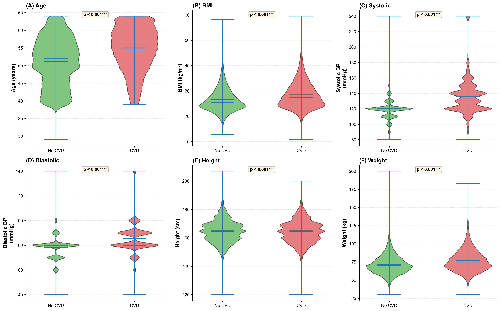
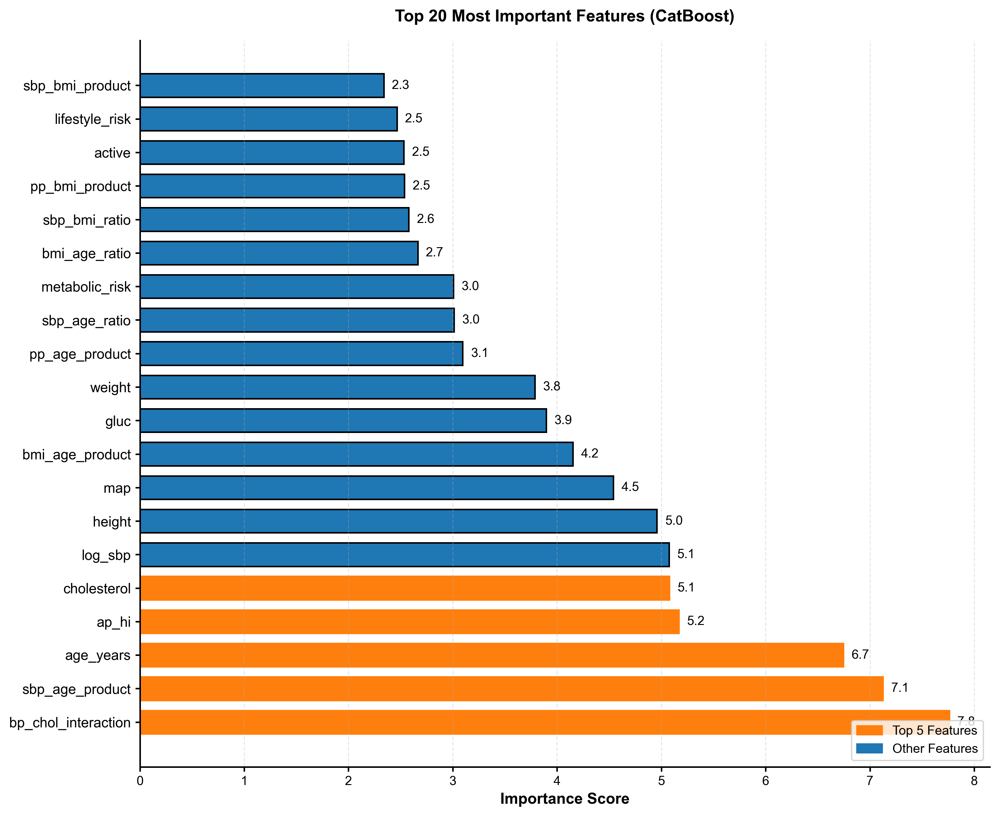

# Cardiovascular Disease Prediction

Machine learning model for CVD prediction using CatBoost. Optimized across 1,004 configurations on 69,912 patients.

[](https://www.python.org/downloads/)
[](https://opensource.org/licenses/MIT)

## Results

**AUC: 0.799** | **Accuracy: 73.3%** | **F1: 72.6%**

## Dataset

[Kaggle Cardiovascular Disease Dataset](https://www.kaggle.com/datasets/sulianova/cardiovascular-disease-dataset) - 70,000 patients with 11 clinical features.

**Citation**: Sulianova, M. (2019). Cardiovascular Disease Dataset. Kaggle.

## Methodology

1. **Data Cleaning**: Removed 88 outliers (0.13%)
2. **Feature Engineering**: 13 → 32 features (BP metrics, BMI interactions, age transformations)
3. **Model Selection**: Tested 5 algorithms (CatBoost, LightGBM, XGBoost, RandomForest, ExtraTrees)
4. **Optimization**: 1,004 experiments, optimal threshold = 0.48

## Visual Results

### Feature Distributions


### Feature Importance



## Quick Start

```
# Install
pip install -r requirements.txt

# Train
python src/train_final_catboost.py --input dataset/cardio_clean.csv --output models/

# Predict
python src/predict_example.py --model models/catboost_model.cbm --scaler models/scaler.pkl --input data.csv
```

## Model Comparison

| Model | AUC | Accuracy | Training Time |
|-------|-----|----------|---------------|
| **CatBoost** | **0.7991** | **73.3%** | 8 min |
| LightGBM | 0.7989 | 73.4% | 5 min |
| XGBoost | 0.7987 | 73.3% | 6 min |

## Repository Structure

```
├── dataset/cardio_clean.csv       # 69,912 samples
├── src/                           # Training & prediction scripts
├── models/                        # Trained CatBoost model
└── figures/                       # visualizations
```

## Key Features

- ✅ Systematic hyperparameter optimization
- ✅ Domain-informed feature engineering
- ✅ Flexible input validation (auto-format conversion)
- ✅ Production-ready with error handling
- ✅ Fully reproducible (seed=42)

## Citation

```
@misc{cvd_prediction_2025,
  title={Cardiovascular Disease Prediction using Optimized CatBoost},
  author={Ghasem Dolatkhah Laein},
  year={2025},
  howpublished={\url{https://github.com/GhIrani33/CVD-prediction-with-CatBoost}}
}
```

## License

MIT License

---
